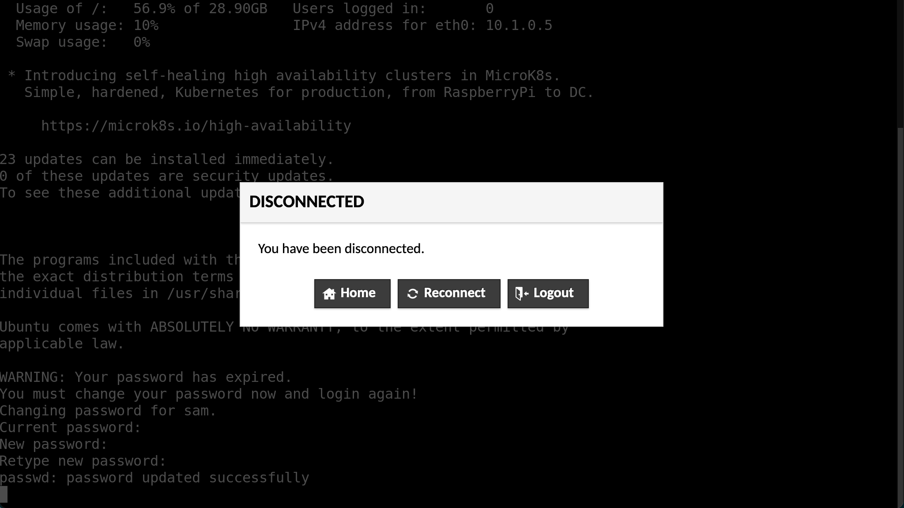

# 📖 User guide

## 🥑 Using Guacamole

See the [Guacamole user
guide](https://guacamole.apache.org/doc/gug/using-guacamole.html). Note that
file transfer is disabled by default.

## 🌱 First login

Before your first login, you will receive two sets of credentials. The 'Web
Portal' credentials are for connecting to the Guacamole portal. After you have
logged in to Guacamole you will be able to select a SSH (text based) or RDP
(graphical desktop) interface to the virtual machine.

You will use the 'VM credentials' to authenticate with the virtual machine
whether using the SSH or RDP connection.

When you have both sets of credentials, open your browser and navigate to the
Guacamole portal and enter your username and password.


You will be asked to create a new password. Enter your new, secure password into
the text boxes and click 'continue'.


When you click 'continue' you will be taken to the multi-factor authentication
setup. **However**, at this point you must refresh the page and login again with
your **new** password.

After you login with your new password, you will again be directed to setup
multi-factor authentication. Scan the QR code using an authenticator app such as
[andOTP](https://github.com/andOTP/andOTP). Produce a one time password, enter
it into the text box and click 'continue'.


You will now be taken to the Guacamole home page and presented with the
available connections, 'DSVM RDP' and 'DSVM SSH'. For your first login, you
**must** use the SSH connection to be able to reset your VM password. Click on
the 'DSVM SSH' connection.

Enter your VM username and press enter.


Next, enter your VM password and press enter.


You will be prompted to change your VM password. Enter the current password, and
press enter. Then enter your new, secure password and press enter. Repeat your
new password to confirm it is correct.


If you successfully update your password, the message `passwd: password updated
successfully` will be printed and you will be disconnected. Click on 'Home' to
go back to the Guacamole home page.



You will now be able to connect to the VM in either an SSH or RDP connection
using your new VM password.

## 🖥️ The Xfce desktop

When you start an RDP session, after entering your credentials, you will be
presented with the [Xfce desktop](https://xfce.org/).

By default there will be two panels on the desktop. A full width panel at the
top of the desktop, and a variable width panel with application icons at the
bottom.

At the left of the top panel is a button labelled 'Applications'. Clicking on
this button will present you with a menu of the installed applications divided
into categories.

To the right of the Applications button will be a list of open application
windows, useful for switching between and managing open windows.

Next is a view of your workspaces. You can use workspaces to collect sets of
windows, for example, you could separate two strands of work on different
workspaces. You can click on the workspaces in the view to switch between them.

Finally, at the far right of the top panel is the system tray which contains a
set of indicators.

Initially, the bottom panel will contain a selection of application launchers as
well as a button to show the desktop (minimise all windows) and a shortcut to
open your home directory in the file explorer.

For additional information on using and modifying the Xfce desktop see the
official documentation for [the desktop
environment](https://docs.xfce.org/xfce/getting-started#the_desktop_environment)
and [common tasks](https://docs.xfce.org/xfce/getting-started#common_tasks)

## 🗄️ Data

The size of your environment's OS disk (which holds the `/home` directory) will
depend on the size of the virtual machine deployed. It should have sufficient
capacity to your configuration and cache files as well as the system-wide
packages, configuration and logs. However, this space is limited and difficult
to scale so it is best to avoid using your home directory for working with large
amounts of data. Instead, you will find the directories described below more
suitable.

Your environment contains three directories intended to help the workflow of
ingress, analysis and egress. There directories are located at

- `/data`
- `/shared`
- `/output`

although you will also find symbolic links to these directories in your home
directory (`~/`) and on your desktop.

Below a description and explanation of each directory is given.

### Input data

The input data for your project will be brought into the environment by an
administrator. You will be able to find it in the `/data` directory. This
directory is visible to all users and is read-only.

If you need to modify the data, for example to clean the data, create derivative
data sets or combine data sets you should first copy the data to your home
directory or the [shared working directory](#shared-working-space).

### Shared working space

The directory `/shared` can be used when multiple users will need to edit files
or directories. This is the best place to keep large data files you may edit and
you working file. New files and directories created here will belong to the
`shared` group, which all users are members of, and members of the `shared`
group will be given read and write privileges. This means that *any user* will
be able to read, edit and delete files and directories created here.

If you want to give files created outside of `/shared` equivalent permissions
(for example something you created in your home directory then copied to
`/shared`) to files created in `/shared` you can run

```bash
chgrp shared myfile
chmod u=rw,g=rw,o= myfile
```

### Output data

The output directory, `/output`, provides a convenient place to put the products
of your work. This directory is writeable by all users. At the end of a project,
data stored here can be reviewed, and extracted from the environment by an
administrator.

## 🛍️ Bundled software

The environment comes pre-loaded with a selection of software which aims to
cover the most common tasks and popular programming languages.

Here these packages are listed along with their version and how to launch them.

### Supported programming languages

| language                                            | version           | docs                                                                       | command or route to application                   | notes                                                                                                                                               |
| ---                                                 | ---               | ---                                                                        | ---                                               | ---                                                                                                                                                 |
| [Python](https://www.python.org/)                   | 3.8, 3.9          | ([3.8](https://docs.python.org/3.8/), [3.9](https://docs.python.org/3.9/)) | `python3`, `python3.9`                            | see the [Python recommended workflow section](#Python) for recommendations on how to use virtual environments to install and manage Python packages |
| [Julia](https://julialang.org/)                     | 1.4               | [docs](https://docs.julialang.org/en/v1.4/)                                | `julia`                                           | see the [Julia recommended workflow section](#Julia) for information on how the default julia depot has been configured                             |
| [Rust](https://www.rust-lang.org/)                  | 1.47 (cargo 1.46) | [docs](https://doc.rust-lang.org/book/)                                    | `rustc`, `cargo`                                  |                                                                                                                                                     |
| [Go](https://golang.org/)                           | 1.13              | [docs](https://golang.org/doc/)                                            | `go`                                              |                                                                                                                                                     |
| [R](https://www.r-project.org/)                     | 3.6               |                                                                            | `R`                                               |                                                                                                                                                     |
| [Octave](https://www.gnu.org/software/octave/index) | 5.2               | [docs](https://octave.org/doc/v5.2.0/)                                     | `octave` or Applications → Education → GNU Octave |                                                                                                                                                     |
| C [gcc](https://gcc.gnu.org/)                       | 9.3               | [docs](https://gcc.gnu.org/onlinedocs/gcc-9.3.0/gcc/)                      | `gcc`                                             |                                                                                                                                                     |
| Fortran [gfortran](https://gcc.gnu.org/)            | 9.3               | [docs](https://gcc.gnu.org/onlinedocs/gcc-9.3.0/gfortran/)                 | `gfortran`                                        |                                                                                                                                                     |
| C++ [gpp](https://gcc.gnu.org/)                     | 9.3               | [docs](https://gcc.gnu.org/onlinedocs/gcc-9.3.0/libstdc++/manual/)         | `gcc` or `g++`                                    |                                                                                                                                                     |

### Development tools

| application                                | version | docs                                                       | command or route to application                | notes |
| ---                                        | ---     | ---                                                        | ---                                            | ---   |
| [git](https://git-scm.com/)                | 2.25    | [docs](https://git-scm.com/docs)                           | `git`                                          |       |
| [gitkraken](https://www.gitkraken.com/)    | 7.5     | [docs](https://support.gitkraken.com/)                     | Applications → Development → GitKraken         |       |
| [dbeaver](https://dbeaver.io/)             | 21.0    | [docs](https://github.com/dbeaver/dbeaver/wiki)            | Applications → Development → DBeaver Community |       |
| [make](https://www.gnu.org/software/make/) | 4.2     | [docs](https://www.gnu.org/software/make/manual/make.html) | `make`                                         |       |
| [cmake](https://cmake.org/)                | 3.16    | [docs](https://cmake.org/cmake/help/v3.16/)                | `cmake`                                        |       |
| [ninja](https://ninja-build.org/)          | 1.10    | [docs](https://ninja-build.org/manual.html)                | `ninja`                                        |       |

### Shells and related

| application                                   | version | docs                                                        | command or route to application | notes                           |
| ---                                        | ---     | ---                                                         | ---                             | ---                             |
| [bash](https://www.gnu.org/software/bash/) | 5.0     | [docs](https://www.gnu.org/software/bash/manual/bash.html)  | `bash`                          | the default shell for all users |
| [zsh](https://www.zsh.org/)                | 5.8     | [docs](http://zsh.sourceforge.net/Doc/Release/zsh_toc.html) | `zsh`                           |                                 |
| [fish](https://fishshell.com/)             | 3.1     | [docs](https://fishshell.com/docs/3.1/index.html)           | `fish`                          |                                 |
| [tmux](https://github.com/tmux/tmux/wiki)  | 3.0     | [docs](https://github.com/tmux/tmux/wiki/Getting-Started)   | `tmux`                          |                                 |

### Editors

| application                                     | version | docs                                                                                       | command or route to application                     | notes |
| ---                                          | ---     | ---                                                                                        | ---                                                 | ---   |
| [vim](https://www.vim.org/)                  | 8.1     | [docs](https://www.vim.org/docs.php) with fugitive, syntastic, airline, latexsuite and vim | julia - `vim` or Applications → Accessories → GVim  |       |
| [neovim](https://neovim.io/)                 | 0.4     | [docs](https://neovim.io/doc/user/)                                                        | `nvim`                                              |       |
| [emacs](https://www.gnu.org/software/emacs/) | 26.3    | [docs](https://www.gnu.org/software/emacs/manual/html_node/emacs/index.html)               | `emacs` or Applications → Development → Emacs (GUI) |       |
| [atom](https://atom.io/)                     | 1.56    | [docs](https://flight-manual.atom.io/)                                                     | Applications → Development → Atom                   |       |
| [sublime](https://www.sublimetext.com/)      | 3.2     | [docs](https://www.sublimetext.com/docs/3/)                                                | Applications → Development → Sublime Text           |       |

### IDEs

| application                                      | version | docs                                             | command or route to application                        | notes                                   |
| ---                                           | ---     | ---                                              | ---                                                    | ---                                     |
| [vscodium](https://vscodium.com/)             | 1.55    |                                                  | Applications → Development → VSCodium                  | community binary distribution of VSCode |
| [pycharm](https://www.jetbrains.com/pycharm/) | 2021.1  | [docs](https://www.jetbrains.com/pycharm/learn/) | Applications → Development → PyCharm Community Edition |                                         |
| [rstudio](https://www.rstudio.com/)           | 1.4     | [docs](https://docs.rstudio.com/)                | Applications → Development → RStudio                   |                                         |

### Containers

| application                                   | version | docs                                             | command or route to application | notes                                                                                                                       |
| ---                                           | ---     | ---                                              | ---                             | ---                                                                                                                         |
| [singularity](https://sylabs.io/singularity/) | 3.7     | [docs](https://sylabs.io/guides/3.7/user-guide/) | `singularity`                   | see the [Containers section of recommended workflows](#Containers-1) for information on using singularity to run containers |

### LaTeX

| application                             | version | docs                                     | command or route to application                        | notes             |
| ---                                     | ---     | ---                                      | ---                                                    | ---               |
| [texlive](https://tug.org/texlive/)     | 2019    | [docs](https://tug.org/texlive/doc.html) | `latexmk`, `latex`, `pdflatex`, `xetex`, `luatex`, ... | full distribution |
| [texstudio](https://www.texstudio.org/) | 2.12    |                                          | Applications → Office → TeXstudio                      |                   |

### Office

| application                                 | version | docs                                                                    | command or route to application                                                                                                                        | notes |
| ---                                         | ---     | ---                                                                     | ---                                                                                                                                                    | ---   |
| [libreoffice](https://www.libreoffice.org/) | 6.4     | [docs](https://documentation.libreoffice.org/en/english-documentation/) | Applications → Office → (LibreOffice, LibreOffice Base, LibreOffice Calc, LibreOffice Draw, LibreOffice Impress, LibreOffice Math, LibreOffice Writer) |       |

## 👔 Recommended workflows

### Python

You will notice that very few Python packages, including pip, are installed
system wide. The intension is for you to manage as many or as few virtual
environments as required for all your strands of work. A strong advantage of
this approach is the multiple virtual environments may be created with the
packages they need, pinned to particular versions if required, without the worry
of maintaining compatible versions globally.

Here is an example. Create a directory for this piece of work

```bash
mkdir /shared/new_project
cd /shared/new_project
```

Create, and enter, a new virtual environment

```bash
python3 -m venv ./venv
source ./venv/bin/activate
```

Your prompt will now (probably) have a prefix like `(venv)` indicating that you
are using the virtual environment. You will notice that
[venv](https://docs.python.org/3/library/venv.html) has installed
[pip](https://pip.pypa.io/en/stable/user_guide/) and added it to your path, so
you can now use pip to install and manage Python packages. For example

```bash
pip install numpy
pip list
pip uninstall numpy
```

Other members of your team can use the new virtual environment in the same way
you did (_i.e._ `source /shared/new_project/venv/bin/activate`).

You will want to communicate with your team to decide how to manage your virtual
environments. For example, deciding how many will be needed, and giving notice
of adding/removing/upgrading packages.

A final tip, keeping a
[`requirements.txt`](https://pip.pypa.io/en/stable/user_guide/#requirements-files)
file is a good way to keep an authoritive list of all packages and their
versions. This way, if anything does go wrong, you can recreate the environment
easily. Also, others may duplicate the environment to ensure your work is
reproducible.

You can create a requirements file based on your currently install packages
with

```bash
pip freeze > requirements.txt
```

You may then install the defined packages (with identical versions) with

```bash
pip install -r requirements.txt
```

### Julia

The default [Julia depot
path](https://docs.julialang.org/en/v1/base/constants/#Base.DEPOT_PATH) has been
changed from `~/.julia` to `/shared/.julia`. This means that for the default
environment will be shared between all users.

Additional environments can be created as required, for example

```julia
julia> mkdir("/shared/my_project")
julia> cd("/shared/my_project")
julia> ]
(@v1.4) pkg> activate .
(my_project)> add JSON
```

See the [Pkg.jl documentation](https://pkgdocs.julialang.org/) for more
information on managing packages and environments.

### Singularity and containers

You will find [Singularity](https://sylabs.io/guides/latest/user-guide)
installed on the DSVM. Singularity is a container platform with a focus on HPC.
It has a number of advantages over docker when we want to run containers as
applications rather than services including, no setup for non-trusted users,
[MPI support](https://sylabs.io/guides/3.7/user-guide/mpi.html), host system
[GPU access](https://sylabs.io/guides/3.7/user-guide/gpu.html).

Singularity can pull containers from [the Singularity
library](https://cloud.sylabs.io/library) as well as [Docker
Hub](https://hub.docker.com/). For example

```bash
singularity pull library://dxtr/default/hpc-tensorflow:0.1
singularity pull docker://alpine
```

The Singularity [Quick Start](https://sylabs.io/guides/latest/user-guide/)
provides a good introduction to the important commands.
